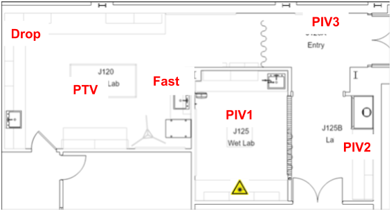

# MAE519: Practical Experimental Methods

| Activity | Indicative timing | PPE |
|---|---|---|
|PIV1 prep. | 20' | gloves |
|PIV2 measure | 30' | Laser goggles|
|PIV3 process | 30'| |
|PTV | 60' | |
|Fast imaging | 60' | |
|Pendant drop | 60' | |

# Installations & Downloads
The 4 modules rely strongly on the following free and open source softwares:
- [ImageJ](https://fiji.sc/)
- [Python](https://www.python.org/), from [Anaconda distribution](https://www.anaconda.com/)
- Python packages: [scikit-image](https://scikit-image.org/), [trackpy](http://soft-matter.github.io/trackpy/)
The processing for PTV, Drop and Fast will be made on the lab computers, you will run the PIV processing from your personal laptop.
See details in the different modules (PIV, PTV, etc), and we can also help for the installation.

# Space occupancy

